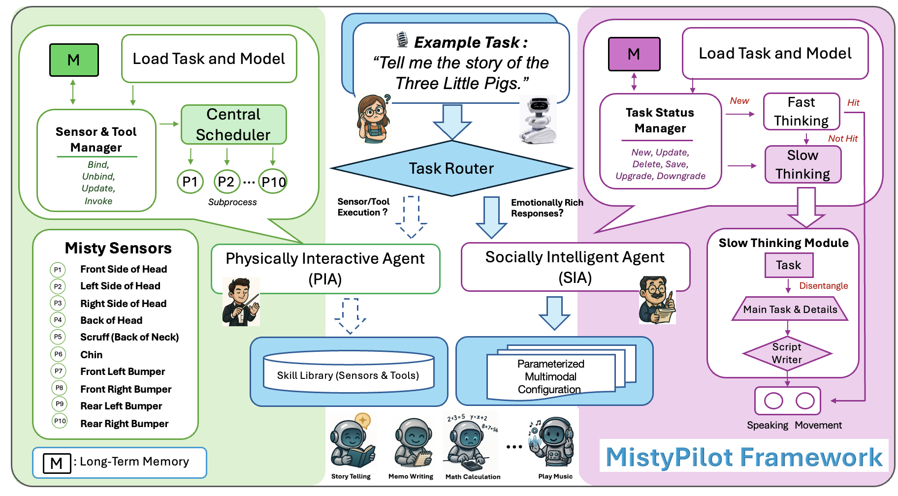

# MistyPilot

🎉 **Accepted at [ACVR 2026](https://iplab.dmi.unict.it/acvr2026/) (ECCV 2026 Workshop) — Oral & Poster**

> 📄 **Paper**: MistyPilot: Enabling Social-Robot Control through Multi-Agent LLM Skill Orchestration
>
> 👥 **Authors**: Xiao Wang\*, Lu Dong\*, Ifeoma Nwogu, Srirangaraj Setlur, and Venu Govindaraju
>
> 🏛️ **Venue**: 14th International Workshop on Assistive Computer Vision and Robotics (ACVR), in conjunction with ECCV 2026 — Malmö, Sweden, September 8, 2026

---

## Overview



---

## Installation

> Local audio playback (`afplay`) and the key-hold recording loop currently target **macOS**.

```bash
conda create -n MistyPilot python=3.10
conda activate MistyPilot
pip install -r requirements.txt
```

---

## Configuration

Edit `MistyPilot_config.json` with your robot IP, OpenAI API Key, and model names. OpenAI model series is currently supported.

```json
{
    "misty_ip": "<Misty robot IP address>",
    "openai_api_key": "<your OpenAI API Key>",
    "llm_model": "<default lightweight model name>",
    "stronger_model_name": "<stronger model name>",
    "retries": 1,
    "threshold": 0.4,
    "store_dir": "./misty_emotion_action_speaking_store",
    "log_dir": "./logs",
    "reg_path": "./misty_proc_registry.json",
    "CB_SUMMARY_JSON_dir": "./cb_functions_summary.json",
    "collection": "text-embedding-3-large",
    "use_local_audio": true
}
```

| Field | Description |
|---|---|
| `misty_ip` | IP address of the Misty robot on the local network |
| `openai_api_key` | OpenAI API Key for LLM inference and speech synthesis |
| `llm_model` | Default lightweight model for fast reasoning |
| `stronger_model_name` | Stronger model used when Slow Thinking or UPGRADE is triggered |
| `threshold` | Fast Thinking retrieval threshold (cosine distance); below this value is treated as a cache hit |
| `use_local_audio` | `true` to play the bundled MP3 sound effects (`Misty_Call_Back_Func/EffectSound/`, `Misty_Call_Back_Func/MistySpeaking/`) on the host machine, `false` to skip |

---

## Usage

Before running, execute `Misty_callback_summary.py` to auto-scan `Misty_Call_Back_Func/` and register all skills into PIA.

Several examples are provided in `Misty_Call_Back_Func/`. When adding a new skill, the file and function must follow this format:

### cb Function Convention

Filename must end with `_cb.py`, and the file must contain a function starting with `cb` with a docstring:

```python
def cb_<emotion>(evt, misty_ip, api_key=None):
    """
    WHEN TO USE:
    - <one-line description of the trigger scenario>

    Chinese keywords: <keywords separated by commas>
    English keywords: <keywords separated by commas>
    """
```

| Field | Requirement |
|---|---|
| `WHEN TO USE` | One sentence describing what the user wants Misty to do |
| `Chinese keywords` | 3–6 core Chinese terms covering common user expressions |
| `English keywords` | 3–6 core English terms covering synonyms and related expressions |

> The docstring is the sole basis for PIA routing. Keywords should cover diverse phrasings; no implementation details needed.

To play a local sound effect from a skill, use the shared helper instead of hardcoding paths:

```python
from local_audio import play_emotion_sounds
play_emotion_sounds(robot, "<EffectSound file>.mp3", "<MistySpeaking file>.mp3")
```

After adding, re-run `Misty_callback_summary.py` to auto-register — no changes to routing logic required.

---

## Running

```bash
python MistyPilot.py
```

On startup, the system loads `cb_functions_summary.json` and builds the PIA routing automatically. The following key bindings are supported:

| Key | Function |
|---|---|
| Hold `C` | Start recording; release to transcribe and execute |
| `A` | Restart MistyPilot voice control system |
| `Ctrl+C` | Quit |


## License

This project is released under the [MIT License](LICENSE).
